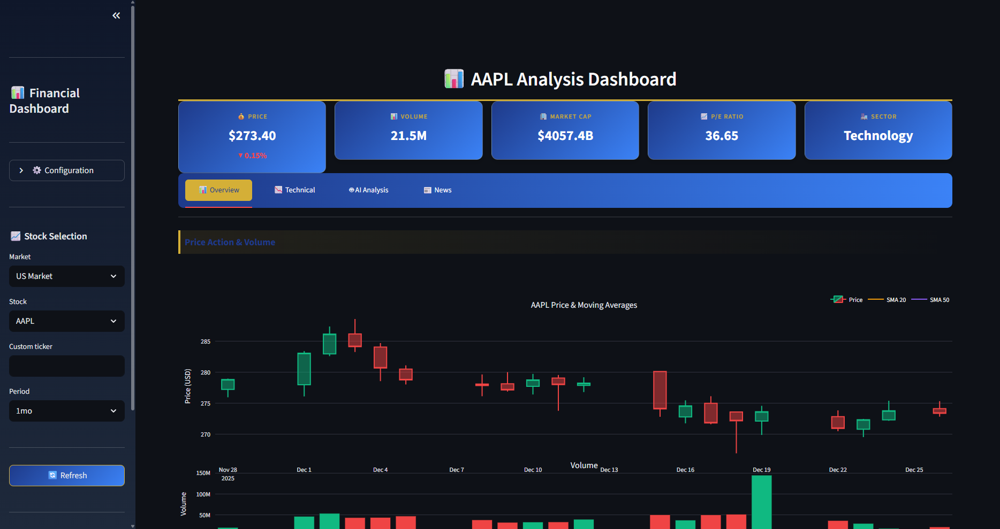
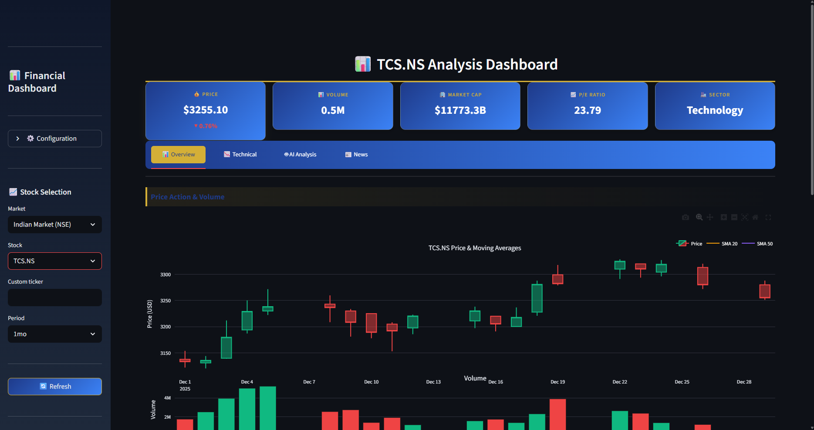
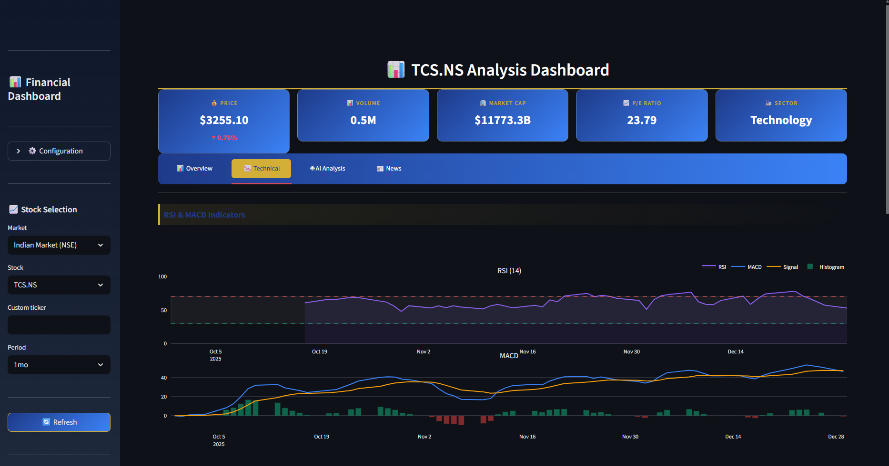
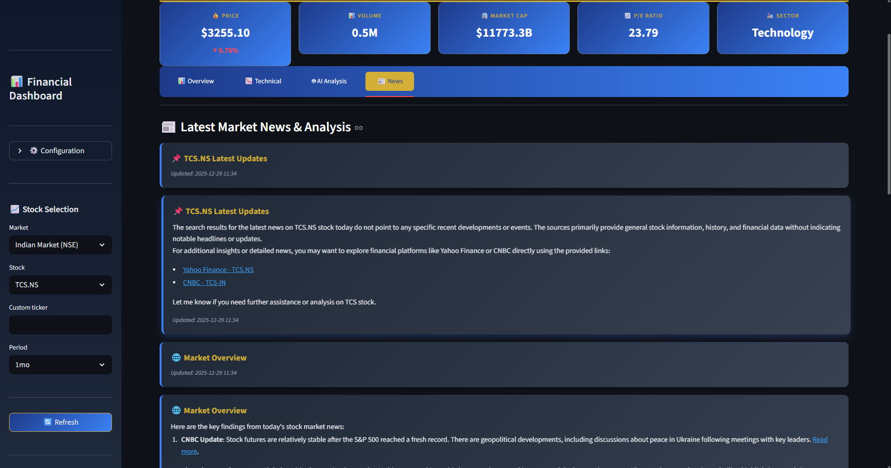
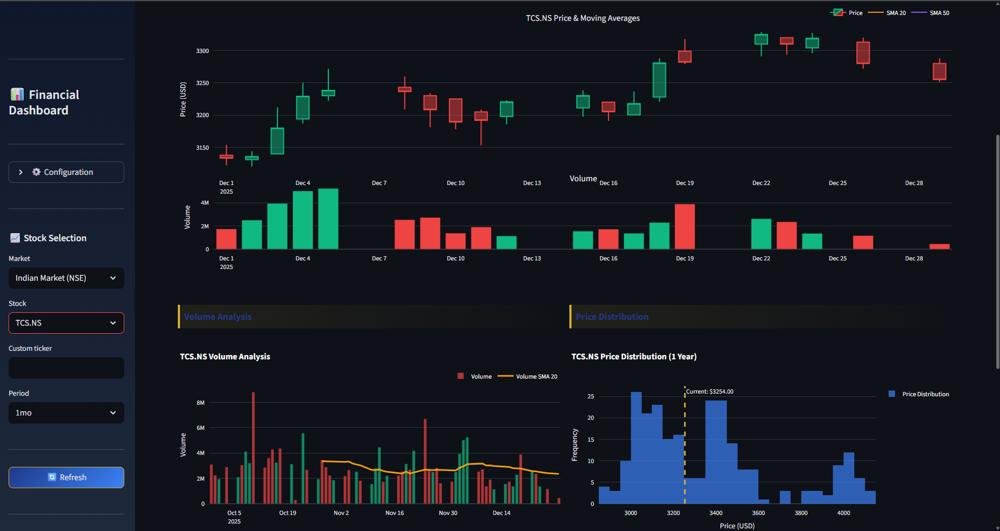

# 📊 AI-Powered Financial Analysis Dashboard

<div align="center">



**A Professional Real-Time Stock Analysis Platform with AI-Powered Insights**

[](https://www.python.org/downloads/)
[](https://streamlit.io/)
[](LICENSE)
[](https://azure.microsoft.com/en-us/products/ai-services/openai-service)

[Features](#-features) • [Demo](#-demo) • [Installation](#-installation) • [Usage](#-usage) • [Tech Stack](#-tech-stack) • [Contributing](#-contributing)

</div>

---

## 🎯 Overview

The **AI-Powered Financial Analysis Dashboard** is a comprehensive stock market analysis platform that combines real-time market data, advanced technical indicators, and AI-powered insights to help traders and investors make informed decisions. Built with Streamlit, Plotly, and Azure OpenAI, this dashboard delivers institutional-grade analytics in an intuitive, modern interface.

### Why This Dashboard?

- 🤖 **AI-Powered Analysis**: Get intelligent stock recommendations using Azure OpenAI and LangGraph
- 📈 **Real-Time Data**: Live market data from Yahoo Finance
- 🔧 **Professional Technical Analysis**: 8+ technical indicators including RSI, MACD, Bollinger Bands
- 📰 **Market News Integration**: Stay updated with latest market news via Tavily API
- 🎨 **Modern UI/UX**: Clean, professional interface with Navy Blue & Gold theme
- 📊 **Interactive Charts**: Beautiful, responsive charts powered by Plotly
- 🌐 **Multi-Market Support**: Analyze US and Indian (NSE) stocks

---

## ✨ Features

### 📊 **Overview Dashboard**


- **Real-time price tracking** with percentage changes
- **Interactive candlestick charts** with volume analysis
- **Moving Averages** (SMA 20, 50, 200)
- **Volume analysis** with trend indicators
- **Price distribution** histogram
- **Monthly returns** heatmap

### 📉 **Technical Analysis**


- **RSI (Relative Strength Index)** with overbought/oversold zones
- **MACD** with signal line and histogram
- **Bollinger Bands** with volatility analysis
- **Support & Resistance** levels
- **Pivot Points** calculation
- **Volume trends** and patterns

### 🤖 **AI-Powered Analysis**


- **Comprehensive stock evaluation** using Azure OpenAI
- **Technical indicator synthesis**
- **Investment recommendations**
- **Risk assessment**
- **Multi-factor analysis** combining all indicators
- **Natural language insights**

### 📰 **Market News**


- **Real-time market news** via Tavily API
- **Stock-specific updates**
- **Market overview** and sentiment
- **Analysis & forecasts** from credible sources
- **Auto-updating** news feed

### 💼 **Key Metrics**

Track essential metrics at a glance:
- Current Price & Changes
- Volume (with historical comparison)
- Market Capitalization
- P/E Ratio
- Sector Classification

---

## 🖼️ Demo

<div align="center">

### Main Dashboard


### Interactive Charts


</div>

---

## 🚀 Installation

### Prerequisites

- Python 3.8 or higher
- Azure OpenAI API access
- Tavily API key (for news features)

### Step 1: Clone the Repository

```bash
git clone https://github.com/Priteshverma123/AI-Agent-Powered-Financial-Analysis.git
cd AI-Agent-Powered-Financial-Analysis
```

### Step 2: Create Virtual Environment

```bash
# Windows
python -m venv venv
venv\Scripts\activate

# macOS/Linux
python3 -m venv venv
source venv/bin/activate
```

### Step 3: Install Dependencies

```bash
pip install -r requirements.txt
```

### Step 4: Configure Environment Variables

Create a `.env` file in the root directory:

```env
# Azure OpenAI Configuration
AZURE_OPENAI_ENDPOINT=your_azure_endpoint
AZURE_OPENAI_API_KEY=your_azure_api_key
AZURE_OPENAI_DEPLOYMENT_NAME=your_deployment_name
AZURE_OPENAI_API_VERSION=2024-02-15-preview

# Tavily API (for news features)
TAVILY_API_KEY=your_tavily_api_key
```

### Step 5: Run the Application

```bash
streamlit run app.py
```

The dashboard will open automatically in your default browser at `http://localhost:8501`

---

## 📖 Usage

### Selecting Stocks

1. **Choose Market**: Select between US Market or Indian Market (NSE)
2. **Pick Stock**: Choose from popular stocks or enter a custom ticker
3. **Set Period**: Select time period (1d, 5d, 1mo, 3mo, 6mo, 1y)

### Navigating Tabs

#### 📊 Overview Tab
- View real-time price charts with candlesticks
- Analyze volume patterns
- Check price distribution
- Review monthly returns

#### 📉 Technical Tab
- Examine RSI and MACD indicators
- Analyze Bollinger Bands
- Review support/resistance levels
- Check moving averages

#### 🤖 AI Analysis Tab
- Get comprehensive AI-powered stock analysis
- Receive investment recommendations
- Understand technical indicator synthesis
- **Note**: Requires Azure OpenAI configuration

#### 📰 News Tab
- Read latest market news
- Get stock-specific updates
- View analysis and forecasts
- **Note**: Requires Tavily API key

### Configuration

Access settings via the sidebar:
- **Config Source**: Choose between config file or manual entry
- **API Keys**: Enter Azure OpenAI and Tavily credentials
- **Status Indicators**: Check API connectivity

---

## 🛠️ Tech Stack

### Core Technologies

- **[Streamlit](https://streamlit.io/)** - Web application framework
- **[Plotly](https://plotly.com/)** - Interactive charting library
- **[yfinance](https://github.com/ranaroussi/yfinance)** - Market data retrieval
- **[Pandas](https://pandas.pydata.org/)** - Data manipulation
- **[NumPy](https://numpy.org/)** - Numerical computing

### AI & Analytics

- **[Azure OpenAI](https://azure.microsoft.com/en-us/products/ai-services/openai-service)** - AI-powered analysis
- **[LangChain](https://www.langchain.com/)** - LLM framework
- **[LangGraph](https://github.com/langchain-ai/langgraph)** - Agent orchestration
- **[Tavily API](https://tavily.com/)** - Real-time news search

### Technical Indicators

- **Moving Averages** (SMA 20, 50, 200)
- **RSI** (Relative Strength Index)
- **MACD** (Moving Average Convergence Divergence)
- **Bollinger Bands**
- **Support & Resistance Levels**
- **Pivot Points**
- **Volume Analysis**

---

## 📁 Project Structure

```
financial-dashboard/
│
├── app.py                      # Main Streamlit application
├── financial_agent.py          # AI agent using LangGraph
├── financial_tools.py          # Technical analysis tools
├── requirements.txt            # Python dependencies
├── .env                        # Environment variables (not in repo)
│
├── utils/
│   └── config.py              # Configuration management
│
├── images/                     # Demo images
│   ├── demo1.png
│   ├── demo2.png
│   ├── overview.png
│   ├── technical.png
│   ├── ai_analysis.png
│   └── news.png
│
└── README.md                   # This file
```

---

## 🎨 Features in Detail

### Technical Indicators

#### RSI (Relative Strength Index)
- **Purpose**: Identifies overbought/oversold conditions
- **Range**: 0-100
- **Signals**: 
  - RSI > 70: Overbought (potential sell)
  - RSI < 30: Oversold (potential buy)

#### MACD (Moving Average Convergence Divergence)
- **Purpose**: Identifies trend changes and momentum
- **Components**: MACD Line, Signal Line, Histogram
- **Signals**:
  - Bullish: MACD crosses above signal line
  - Bearish: MACD crosses below signal line

#### Bollinger Bands
- **Purpose**: Measures market volatility
- **Components**: Upper Band, Middle Band (SMA), Lower Band
- **Signals**:
  - Price touching upper band: Overbought
  - Price touching lower band: Oversold

#### Volume Analysis
- **Purpose**: Confirms price movements
- **Metrics**: Current vs. Average Volume
- **Signals**:
  - High volume + price increase: Strong buying
  - High volume + price decrease: Strong selling

### AI Analysis Features

The AI agent combines:
- All technical indicators
- Historical price patterns
- Volume trends
- Market sentiment
- Support/resistance levels

To provide:
- **Overall Sentiment** (Bullish/Bearish/Neutral)
- **Risk Assessment**
- **Entry/Exit Points**
- **Investment Recommendations**

---

## 🔧 Configuration Options

### Sidebar Settings

1. **Config Source**
   - Config file (automatic from .env)
   - Manual entry (enter credentials directly)

2. **Stock Selection**
   - Market: US or Indian (NSE)
   - Popular stocks dropdown
   - Custom ticker input
   - Time period selector

3. **Status Indicators**
   - 🟢 Azure AI: Connected
   - 🟢 News API: Connected
   - 🔴 Service: Not configured

---

## 📊 Supported Markets & Stocks

### US Market
- Apple (AAPL)
- Microsoft (MSFT)
- Google (GOOGL)
- Amazon (AMZN)
- NVIDIA (NVDA)
- Meta (META)
- Tesla (TSLA)
- + Any US stock ticker

### Indian Market (NSE)
- Reliance (RELIANCE.NS)
- TCS (TCS.NS)
- HDFC Bank (HDFCBANK.NS)
- Infosys (INFY.NS)
- + Any NSE stock ticker

---

## 🤝 Contributing

Contributions are welcome! Here's how you can help:

1. **Fork the repository**
2. **Create a feature branch**
   ```bash
   git checkout -b feature/AmazingFeature
   ```
3. **Commit your changes**
   ```bash
   git commit -m 'Add some AmazingFeature'
   ```
4. **Push to the branch**
   ```bash
   git push origin feature/AmazingFeature
   ```
5. **Open a Pull Request**

### Development Guidelines

- Follow PEP 8 style guide
- Add docstrings to all functions
- Include type hints
- Write meaningful commit messages
- Test thoroughly before submitting PR

---

## 🐛 Known Issues & Limitations

- **Data Delay**: Market data has a ~15-minute delay (Yahoo Finance limitation)
- **API Costs**: Azure OpenAI and Tavily API have usage costs
- **Rate Limits**: APIs have rate limiting; excessive requests may fail
- **Historical Data**: Limited to periods supported by yfinance

---

## 🔮 Future Enhancements

- [ ] Portfolio tracking and management
- [ ] Watchlist functionality
- [ ] Price alerts and notifications
- [ ] Backtesting capabilities
- [ ] Multiple timeframe analysis
- [ ] Options chain analysis
- [ ] Fundamental analysis integration
- [ ] Social sentiment analysis
- [ ] Mobile responsive design
- [ ] Dark/Light theme toggle
- [ ] Export reports to PDF
- [ ] Historical comparison tools

---

## 📝 License

This project is licensed under the MIT License - see the [LICENSE](LICENSE) file for details.

---

## 🙏 Acknowledgments

- **Yahoo Finance** for providing free market data
- **Azure OpenAI** for AI capabilities
- **Tavily** for real-time news search
- **Streamlit** for the amazing web framework
- **Plotly** for beautiful interactive charts
- **LangChain & LangGraph** for LLM orchestration

---

## 📧 Contact

**Your Name** - [@yourtwitter](https://twitter.com/yourtwitter)

Project Link: [https://github.com/yourusername/financial-dashboard](https://github.com/yourusername/financial-dashboard)

---

## ⭐ Show Your Support

If you find this project useful, please consider giving it a ⭐ on GitHub!

---

<div align="center">

**Built with ❤️ by [Your Name]**

[⬆ Back to Top](#-ai-powered-financial-analysis-dashboard)

</div>